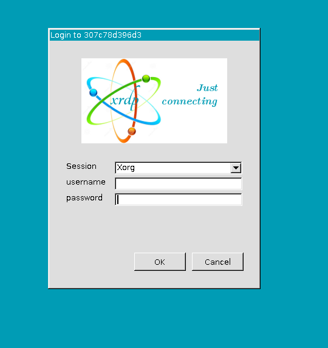

.. _method1:

Method 1: Fast Installation with Container Technique
============================================================
Docker
---------

Make sure you have Docker installed, if not, please follow the instructions on the `Docker website <https://docs.docker.com/install/>`_ to install Docker.

1. Pull the SBCI Docker image
------------------------------

.. code-block:: bash

    docker pull jiaqiding/sbci_abcd:1.0

2. Run the new container for the pulled image
---------------------------------------------

.. code-block:: bash

    docker run  -it -p [your machine port]:3389/tcp --name [your container name] docker.io/jiaqiding/sbci_abcd:1.0 /bin/bash

Use ``-p`` to specify [your machine port], this will be used to launch the virtual desktop. Use ``--name`` to give a name to your container.

Now ``[your machine port]`` is hosting the desktop of this docker container.

.. tip::
    If your machine doesn't have desktop, then you need to map the port to a computer with desktop

Open the cmd/terminal on your computer to connect the port on the machine that your container is working on:

.. code-block:: bash

    ssh [your machine IP] -L [your computer port]:localhost:[your machine port]

Now ``[your computer port]`` is hosting the desktop of this docker container. Keep this ``ssh`` connected.

3. Launch the virtual desktop to activate Matlab
------------------------------------------------

a. Connect to the desktop
^^^^^^^^^^^^^^^^^^^^^^^^^

Open application named **Remote Desktop Connection**.

Type ``localhost:[your machine/computer port]`` in the address blank. Click ``connect``, then you'll see the login page.

username: ``root``

default password: ``1234``

b. Activate the Matlab
^^^^^^^^^^^^^^^^^^^^^^

Click the ``Application`` -> ``Development`` -> ``Matlab``. Then use your own Matlab account to activate the Matlab.

